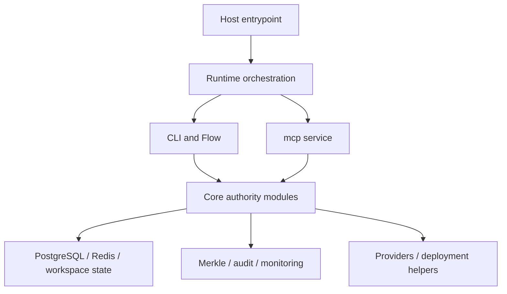

This page maps the repository and runtime at system level before the deeper module pages break it apart.

**Audience:** Developer

**Context:** Start here if you need the codebase map, primary boundaries, and the relationship between runtime packaging, CLI, Flow, and core enforcement modules.

## Core Explanation

Caracal's open-source architecture has five main layers:

### Repository map

| Path | Responsibility |
| --- | --- |
| `caracal/runtime` | Host entrypoints, compose resolution, restricted shell, runtime-mode utilities |
| `caracal/cli` | In-container Click CLI command groups |
| `caracal/flow` | Terminal UI application, state, themes, screens, and workspace helpers |
| `caracal/core` | Principals, policies, mandates, delegation, authority validation, crypto, audit, metering |
| `caracal/db` | SQLAlchemy models, connection management, migrations, partitioning, materialized views |
| `caracal/redis` | Redis client and mandate cache |
| `caracal/merkle` | Tree building, batching, signing, verification, snapshots, backfill, recovery |
| `caracal/mcp` | MCP HTTP service and adapter enforcement layer |
| `caracal/provider` | Provider definitions, catalog helpers, workspace provider registry |
| `caracal/deployment` | Config manager, mode and edition handling, sync state, migration helpers |
| `caracal/monitoring` | Health checks, metrics registry, metrics HTTP server |
| `deploy/` | Compose files, Dockerfiles, runtime deployment assets |
| `tests/` | Unit, integration, e2e, security, and validation scripts |
| `sdk/` | SDK source trees, intentionally documented later |

## Boundary Map

### Host versus runtime

The host command is intentionally shallow. Its responsibility is starting, stopping, and entering the runtime, not performing authority operations itself.

### User experience layers

The CLI and Flow are parallel frontends over shared backend logic. They do not maintain separate authority models or persistence layers.

### Core authority layer

The core layer defines the authority model itself:

- principal identity
- policy constraints
- mandate issuance and revocation
- delegation graph rules
- validation and fail-closed denial
- authority and metering ledgers

### Data and integrity layer

PostgreSQL is the system of record. Redis accelerates selected workflows. Merkle modules provide tamper-evident integrity operations over ledger data.

## Internal Behavior

Several implementation choices are architectural, not incidental:

- `DatabaseConnectionManager` treats PostgreSQL as the only supported database backend.
- workspace resolution happens early so config, logs, backups, cache, and keys stay aligned.
- provider-scoped scopes connect external integrations directly to the authority model.
- runtime compose resolution supports repository checkouts, packaged installs, and an embedded fallback compose file.

## Edge Cases And Constraints

- The repository still contains enterprise stubs and public connector surfaces, but the open-source docs only describe public boundaries.
- Some files retain legacy or compatibility behavior, but the current runtime model is container-first and PostgreSQL-backed.

## Related Concepts

- [Runtime Model](/open-source/developers/runtime-model)
- [Core Authority System](/open-source/developers/core-authority-system)
- [Storage and Data](/open-source/developers/storage-and-data)
- [Services and Integrations](/open-source/developers/services-and-integrations)
