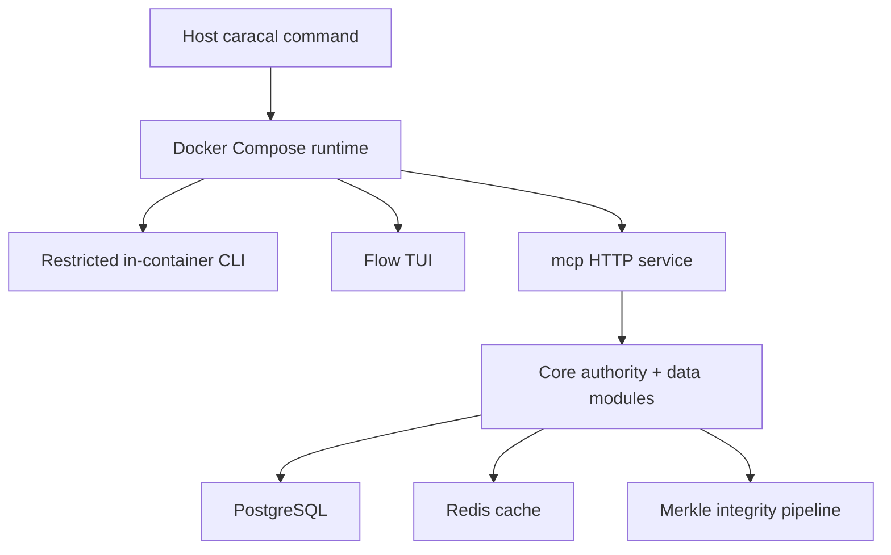

Caracal is a container-first authority-enforcement system for agentic workloads.

**Audience:** Both

**Context:** Start here if you need to understand what the open-source runtime contains, where the main execution surfaces are, and how the public docs are split.

## Core Explanation

Caracal sits between an agent decision and the action that would execute. In the open-source runtime, that means:

- principals are registered as identities that can hold authority
- authority policies constrain what mandates may be issued
- execution mandates grant time-bound, signed permission for a specific scope
- delegation edges model authority handoff between mandates
- validation happens before a protected action is executed
- authority and metering events are persisted for auditability

The open-source project is not a single monolithic CLI. It has three distinct layers:

## Execution Surfaces

### Host command

The top-level `caracal` command on the host is an orchestrator. In `caracal/runtime/entrypoints.py` it resolves a compose file, starts or stops containers, opens logs, launches the CLI session, and launches Flow.

Important consequence:

- `caracal up`, `caracal down`, `caracal logs`, `caracal cli`, and `caracal flow` are host operations
- they are about runtime lifecycle, not about policy or mandate management

### In-container CLI

When you enter `caracal cli`, the same command name now means the restricted interactive Caracal CLI inside the runtime container. That CLI is implemented with Click under `caracal/cli`. It is workspace-aware and exposes the operational command surface for principals, policies, authority, providers, backups, migrations, and more.

### Flow TUI

`caracal flow` launches the terminal UI implemented under `caracal/flow`. It uses the same workspace and backend services as the CLI, but presents guided flows for onboarding, workspace management, provider configuration, mandates, delegation, logs, and settings.

## Open-Source Boundaries

The public open-source runtime includes:

- the host orchestrator
- the in-container CLI
- Flow
- PostgreSQL-backed core data models
- Redis-backed cache integrations
- MCP service and adapter code
- provider catalog and workspace provider registry
- monitoring, Merkle integrity, migrations, and release tooling

The public docs do not document enterprise internals. Enterprise remains present only as a high-level public placeholder lane, and SDK navigation is present only as future structure.

## How To Read The Docs

Use the `End Users` lane if you are operating the runtime.

Use the `Developers` lane if you are reading or changing the repository.

If you are unsure where to start:

- go to [Installation](/open-source/end-users/getting-started/installation) if you need a working runtime
- go to [Concepts](/open-source/end-users/concepts) if you need the public mental model
- go to [Architecture](/open-source/developers/architecture) if you need the repository map

## Edge Cases And Constraints

- The host command and the in-container CLI intentionally share the `caracal` name, so context matters.
- PostgreSQL is the only supported database backend in the open-source runtime.
- Redis and Merkle features are treated as required parts of the runtime model, even where legacy compatibility fields still exist in configuration.
- Enterprise URLs and enterprise-only behavior may appear as public connector surfaces, but the internals remain out of scope for the open-source docs.

## Related Concepts

- [Open Source End Users](/open-source/end-users)
- [Open Source Developers](/open-source/developers)
- [CLI](/open-source/end-users/cli)
- [Architecture](/open-source/developers/architecture)
